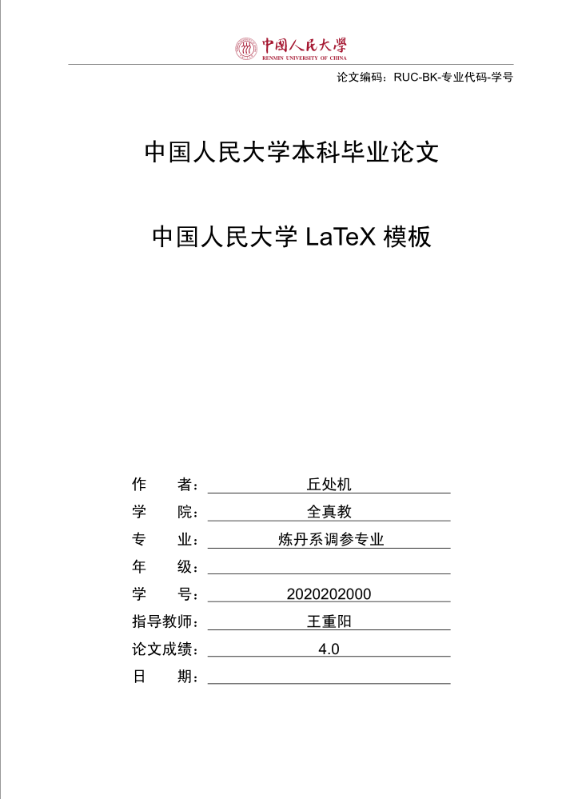

# Don't Panic


# 中国人民大学LaTeX论文模板——不要担心，这个项目一定可以运行

> 符合学校和老师的模板就是好模板，你需要仔细的考虑自己是否需要LaTeX，其实 Word 也是不错的软件。

> 临近毕业，发邮件提问的学弟学妹越来越多了，但一个人的精力有限，有些问题是重复的，有的问题涉及的细节很多。更希望大家开[issue](https://github.com/GH1995/RUC-thesis-template-for-LaTeX/issues)讨论，或者直接发PR给我，这样可以帮助更多的人。


目前支持本科、硕士（学硕+专硕）和博士，排版出来的封面和下面差不多，可以在 [overleaf](https://www.overleaf.com/read/kmjxwrcjstqx
) 上直接预览 



如果已经有`ructhesis.cls`文件的可以直接使用。目前的版本使用了[2015国标](https://github.com/ustctug/gbt-7714-2015)的参考文献样式.

这里我们使用`xelatex`作为排版引擎，这里不建议大家选用其他引擎，比如`pdflatex`之类的，一个原因是这些引擎对于中文的支持不太好，另外`xelatex`更新也比较快。至于网上抱怨的`xelatex`编译性能的问题，实际上我们要知道，一个需要1s编译完成，另一个需要2s，关注这种差别没有意义。

还需要提醒的一点是，我们推荐你使用 Linux，因为无论是MacTex还是Windows上的TexLive安装都容易出错。你会为了排查这种错误而浪费大量的时间。

我们推荐使用`UTF-8`编码，请拒绝GBK，GB2312和BOM等编码。很不幸的是 Windows 上的默认编码不是 `UTF-8`的，我们推荐你使用`vim/emacs`，Visual Code 或者 Sublime Text  作为编辑工具。这里面我们已经为 vim 配置好了 LaTeX 写作环境，推荐你使用[它](https://github.com/GH1995/vimrc)。


## 字体文件

如果你使用Ubuntu，极有可能是欠缺一部分关键字体，但是不用担心，我们已经打包好了，可以从[这里](http://pan.baidu.com/s/1eRFJXnW)下载。鉴于百度云的速度实在太慢，建议比较着急的用户直接按字体的名称搜索下载即可。我个人比较喜欢把字体安装在，自己的工作目录下，这样不会和别人共享字体，但是也避免干扰全局环境。记得安装好之后更新一下字体缓存。

- `Times New Roman`
- `Arial`
- `Courier New`
- `宋体`
- `黑体`
- `仿宋`
- `方正小标宋`


## Ubuntu安装LaTeX

如果你已经安装好了字体，其实没有安装好也没关系，我们这样就要安装 LaTeX 了。如果你用百度搜索，可能会有些人告诉你那些包需要安装，那些不需要安装，这样可以节省空间。我个人相信人大的学生硬盘还没有这么促狭，我们直接安装了所有 LaTeX 依赖，大概需要 5GB左右的空间，这样可以避免以后的口水官司。

```shell
sudo apt install texlive-full
```

## 使用的宏包（没问题就忽略）

这部分可以全部忽略，因为我们使用的 tex 包全部都是TeX Live自带的。

- `ctexbook`
- `geometry`
- `hyperref`
- `graphicx`
- `titletoc`
- `ifxetex`
- `ifthen`
- `calc`
- `lscape`
- `multicol`
- `color`
- `pstricks`

## 如果你也和我一样使用vim，这里给你准备了插件和推荐配置（这个是我们推荐的）

安装`lervag/vimtex`，配置参考[这里](https://github.com/GH1995). `cp dotfile/latexmkrc ~/.latexmkrc`，`vimtex`的配置可以直接使用[这个](https://github.com/GH1995/vimrc/blob/master/config/vimtex.vim).

如果你和我一样使用终端写代码，这样是无法直接查看pdf的。每次编译完成之后再拷贝出来过于麻烦，我们在工作目录下执行这条命令就可以建一个 web 服务器。

```sh
python3 -m http.sever port
```
现在你就可以在浏览器里查看了，我们建议你使用浏览器的无痕模式，不会缓存pdf，可以立即看到更新。配置好的vim的用法如下：

| 按键  | 用法            |
|------:|:----------------|
| `\ll` | 编译            |
| `\lv` | 查看pdf         |
| `\lc` | 清理，保留pdf   |
| `\lC` | 清理，不保留pdf |

## 在Windows下使用（可以但是不推荐）

1. 安装[Tex Live](http://www.tug.org/texlive). 把`bin`目录例如`D:\texlive\2016\bin\win32`加入`PATH`环境变量.
2. 安装字体. [下载地址](http://pan.baidu.com/s/1eRFJXnW)，有的字体Windows自带了，有的字体Ubuntu自带了，但都不全，还是一次性安装完所有字体比较方便.
3. 安装[TeXstudio](http://texstudio.sourceforge.net)
4. 配置TeX Studio
    - 启动TeX Studio，选择 `Options-->Configure Texstudio-->Commands`，`XeLaTeX` 设置为 `xelatex -synctex=1 -interaction=nonstopmode %.tex`
    - 选择 `Options-->Configure Texstudio-->Build`
    - `Build & View` 由默认的 `PDF Chain` 改为 `Compile & View`
    - `Default Compiler` 由默认的`pdfLaTeX`修改为`Xelatex`
    - `PDF Viewer`改为`Internal PDF Viewer(windowed)`，这样预览时会弹出一个独立的窗口，这样比较方便
5. 编译. 用`TeX Studio`打开`main.tex`，点击界面上的绿色箭头就可以开始编译了. 在下方的窗口可以看到`TeX Studio`正在使用的编译命令是`xelatex -synctex=1 -interaction=nonstopmode "main".tex`

## 在Ubuntu下用Tex Studio编译（可以但是没必要）
1. `sudo apt install texlive`
2. 安装字体. `mkdir ~/.fonts && cd ~/.fonts`, 把下载好的字体解压复制到这个文件夹，然后`fc-cache -f -v`；
3. 安装`sudo apt install texstudio`
4. 配置`TeX Studio`
    - 启动`TeX Studio`，选择 `Options-->Configure Texstudio-->Commands`，`xelatex` 设置为 `xelatex -synctex=1 -interaction=nonstopmode %.tex`；
    - 选择 `Options-->Configure Texstudio-->Build`
    - `Build & View` 由默认的 `PDF Chain` 改为 `Compile & View`
    - `Default Compiler` 由默认的`pdflatex` 修改为 `xelatex`
    - `PDF Viewer` 改为 `Internal PDF Viewer(windowed)`，这样预览时会弹出一个独立的窗口，这样比较方便.
5. 编译. 用`TeX Studio`打开`main.tex`，点击界面上的绿色箭头就可以开始编译了. 在下方的窗口可以看到`TeX Studio`正在使用的编译命令是`xelatex -synctex=1 -interaction=nonstopmode "main".tex`

## 结束

如果你有其他专业问题，发邮件给我吧。`guanhua#ruc.edu.cn`
